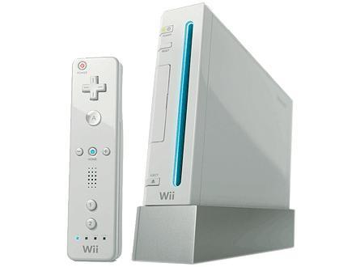

The Wii
=======

Information About Wii
---------------------
The **Nintendo Wii**, a console created in 2006, is a
interactive gameplay with the use of wireless controllers 
for a better experience.  It uses infrared detection to sense
the position of the controllers.  The controllers are 
designed to allow for movement gestures as well as easy 
button-pressing and are connected with the console via 
Bluetooth.  At the time of its release in 2006, the Wii
was the smallest console that Nintendo had, outside of
handheld devices.  The Nintendo Wii has a 512 megabyte
internal flash memory with a slot for SD card.  That can be 
used to store pictures, backing up save game data, and 
anything that may be stored on the Wii itself.  Wii also 
stayed on top of the game with allowing the console to have 
backward compatibility with all Nintendo GameCube 
Software.  There is a latch the flips open that allows the 
GameCube controller to plug into it but you cannot use any 
other controller to player the GameCube games and same with 
Wii.  The user must also have a GameCube Memory card to save 
the game progress.

Nintendo Wii Consoles
---------------------
* Wii
* Wii Mini
* Wii U

Amazon List Price 
-----------------
========== ============ =======
Console    Release Year Price
========== ============ =======
Wii        2006         $79.99
Wii Mini   2012         $332.00
Wii U      2012			$589.00
========== ============ =======

Reviews
-------
Click the link to view the global score and average critic 
score given by `Engadget`_.

.. _Engadget: https://www.engadget.com/products/nintendo/wii/console/

