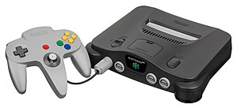

Nintendo 64
===========

Information on the Nintendo 64
------------------------------ 

The **Nintendo 64**, which was released in 1996, was the 3rd 
home video game console the Nintendo had created, this 
excludes handheld devices.  This device was released to the 
public as a playable model in 1995 but was not open for sale 
until June of 1996.  Once this device was released, the 
300,000 units in the shipment had been sold out.  In order 
for this device to compete with other companies in the US, 
the price had been marketed at $199.99 so it was in the 
run.  What is found as surprising is that this console was 
unlike any others in North America when looking at the 
target audience.  While consoles like Saturn and PlayStation 
were focusing on teens, Nintendo 64 was looking at the 
pre-teens (ages 4-12).  This is allowed for a widespread 
variety of games to promote parents to buy this product for 
their young children.  At the time of the release, the 64 
was getting positive reviews on the quality of the console 
but was getting negative reviews for lacking on how many 
games were created alongside it during the year it was 
released.  This product was an overall sensation to many 
people.  While it still had its negative reviews, it 
overrode them with positive reviews and allowed for people 
to experience in-home enjoyment with this home video game 
console.

Amazon List Price
-----------------

============ =======
Current Year Price
============ =======
2017         $62.29
============ =======

Reviews
-------
Click the link to view the reviews by users on `Amazon`_.

.. _Amazon: https://www.amazon.com/Nintendo-64-System-Video-Game-Console/product-reviews/B00002DHEV

