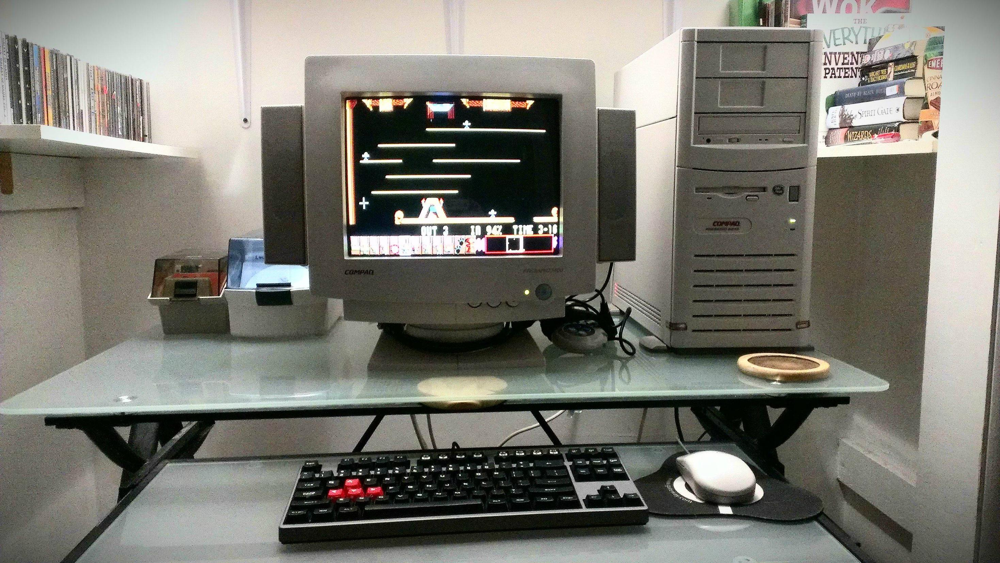

A Brief History of Gaming Computers 
===================================

The history of gaming computers spans back to the 1980s when users demanded advanced graphics and sound capabilities from their computers. Gaming computer enthusiasts pushed the market to develop better color fidelity eventually leading to the development of display systems such as CGA and VGA which then later entered mainstream usage. Gaming computers helped promote network cards and routers among the consumer population as LAN based parties wanted ways to connect their computers. By 1993 companies like Falcon Northwest began advertising computers built with gaming in mind. By this point the video gaming market had greatly risen in popularity and would continue growing through the development of video game consoles, and ever growing graphics capabilities. By the time 2012 rolled around many pc gamers turned to building their own systems due to the sheer amount of parts on the market and the different combinations they could be built in to match the user’s needs. Gaming computers will continue to evolve as gaming enthusiasts seek out the best graphics and best overall gaming experience possible.

Benchmark Groups
----------------

Many organizations have formed over the years to help gamers benchmark their builds and squeeze out all the performance they can out of any part that hits the market. Among these organizations ones like AnandTech and Tom’s Hardware Guide have become some of the most popular and trusted benchmarker’s.

Source: `Wikipedia`_

    Source: `Reddit`_

.. _Wikipedia: https://en.wikipedia.org/wiki/Gaming_computer

.. _Reddit: https://www.reddit.com/r/pcmasterrace/comments/21yca5/with_all_the_posts_of_old_pc_parts_here_is_my/