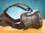

The Release of VR systems
=========================

One of the newest innovations to hit the gaming market is the **VR** or virtual
reality headsets. These systems have pushed the gaming computers performance 
to its limits in the past few years. New graphics cards have been built with 
VR performance in mind along with the anticipated rise of *4K* gaming. 

VR Workings
-----------

The VR headsets work by attaching a small screen to a headset that also has 
audio capabilities. This headset rests on your head with the VR screen pressed 
to your face to create an enclosed "room" around the eyes so that the viewer 
feels surrounded by the image. This creates an effect that makes you feel like 
you are in the game, hence the term virtual reality. This new system has become 
extremely popular and is one of the most anticipated expansions to the gaming 
world in a long time. Below is a list of three of the top VR systems currently 
available. There are many more VR systems available, but these are some of the 
most popular at the time. While VR gaming still remains in its infancy, it has 
shown true potential that could change the definition of gaming at its core.

=================== =======
VR System           Cost
=================== =======
HTC Vive            $599.00
Oculus Rift         $399.00
Sony Playstation VR $344.99
=================== =======

Source: `HTCVive`_

.. _HTCVive: https://www.pcmag.com/article/342537/the-best-virtual-reality-vr-headsets