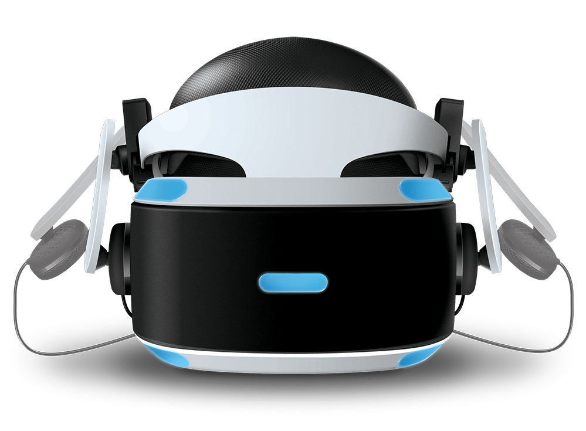

PlayStation VR
==============

PlayStation VR is Playstations foot in the door to virtual reality systems. Coming
in at $349 and the need of a playStation 4 and a game, it is quite expensive. Not
a lot of people own the VR. Current competitors include: Oculus Rift, HTC Vive,
Samsung Gear VR, and the Google Daydream View.

Top Games
---------

* Batman: Arkham VR
* Resident Evil 7
* DOOM VR
* COD: Infinite Warfare's Jacks Assault
* The Playroom VR
* Skyrim VR
* Arizona Sunshine
* Star Trek: Bridge Crew
* Superhot VR
* Thumper
* DiRT: Rally

