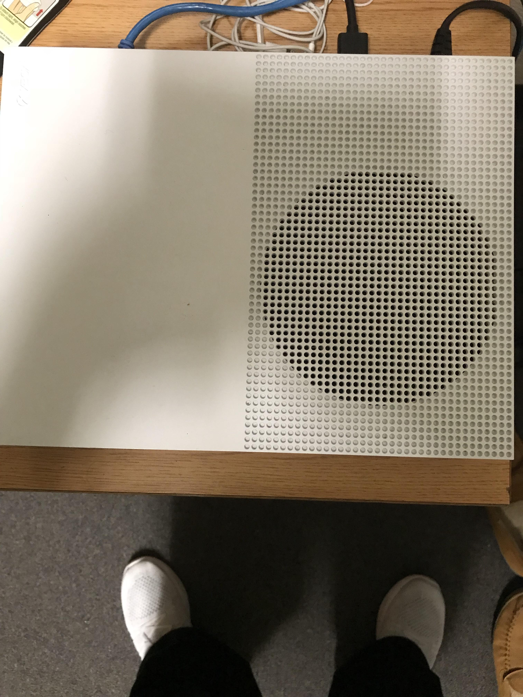
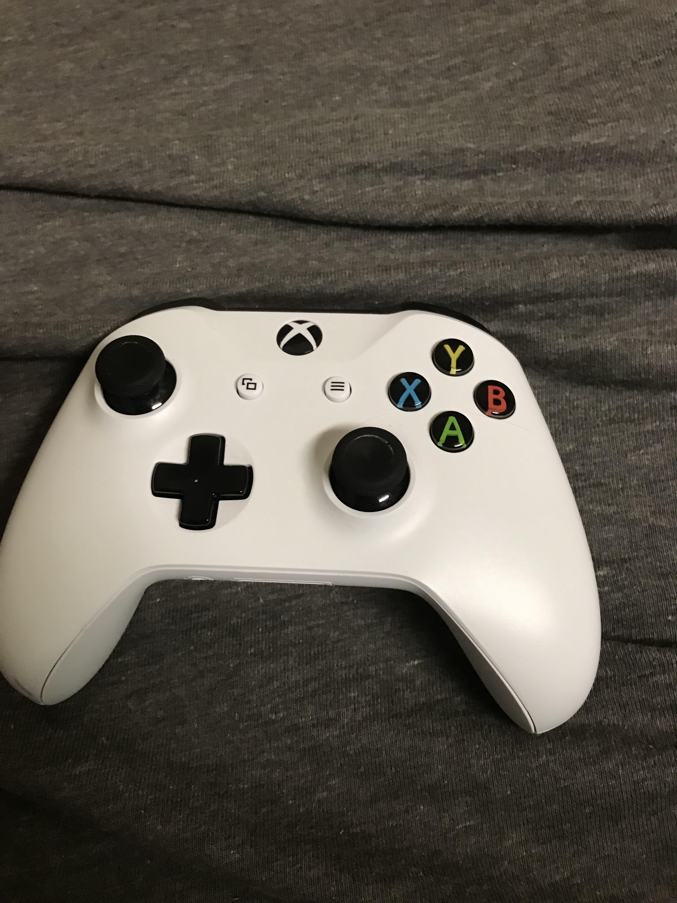
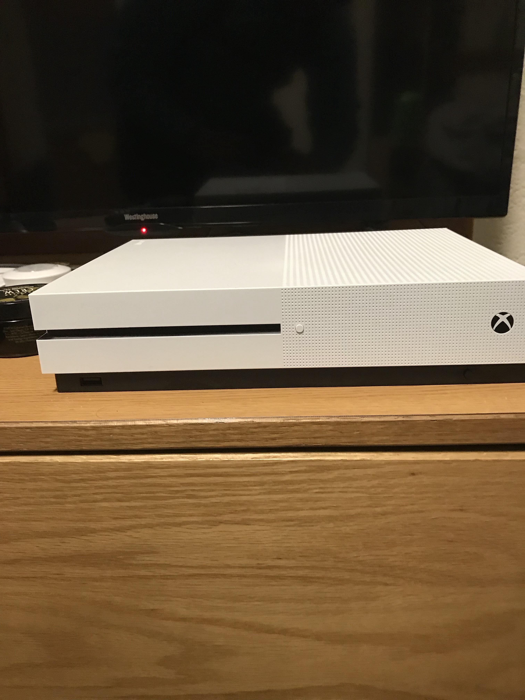

Xbox One
========

The Xbox One is a newer console in which Microsoft 
drifted away from their all black models and released a 
white model. this new Xbox or the Xbox one has many new 
features that allow you do a variety of different things 
that you couldn't do before on the older models. On the 
Xbox One you have the ability to play Blu-ray discs and 
the ability to play music from the Xbox. This newer 
model is used to compete with Nintendo’s WiiU and Sony’s 
Playstation 4 which both came out around the same time 
that the Xbox one came out. Microsoft made the Xbox One 
the smallest version of the Xbox yet. The goal of this 
was to allow its users the opportunity to take the Xbox 
One on the go and to also allow for easier storage, 
rather than having the bulky console out. They also 
added a vertical feature with a part that hooked into 
the Xbox One and allowed the user to stand it up on its 
side rather than leaving it flat. This also added a more 
convenient way of storing your gaming console.

